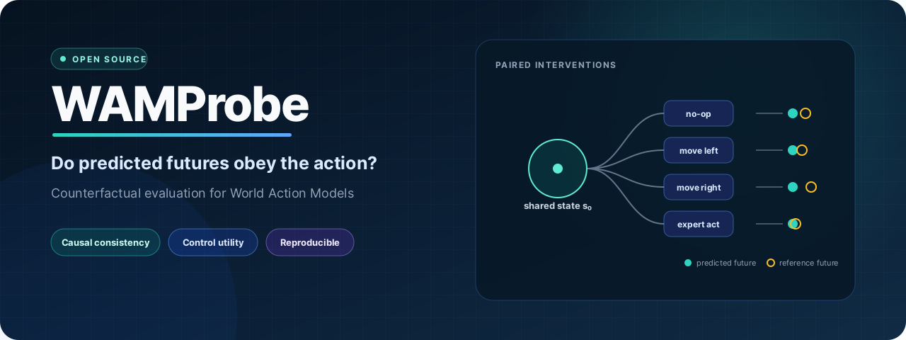
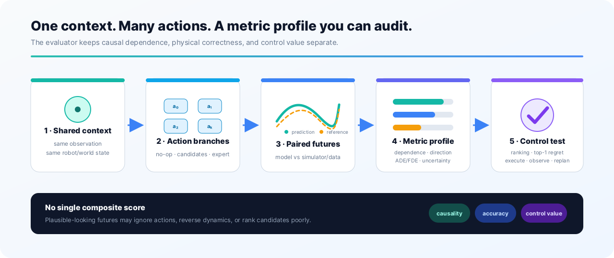
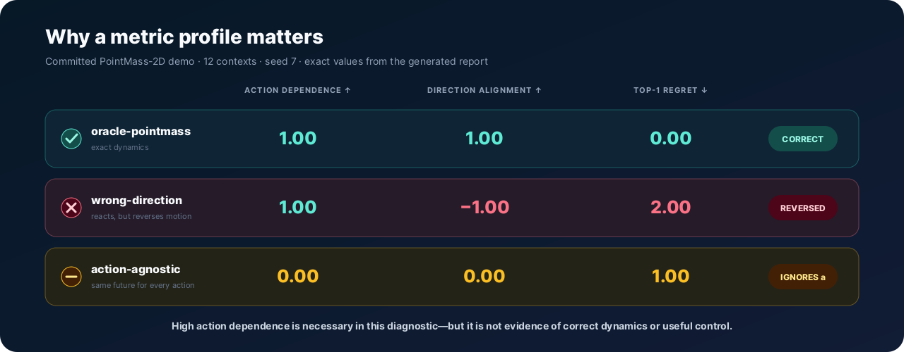
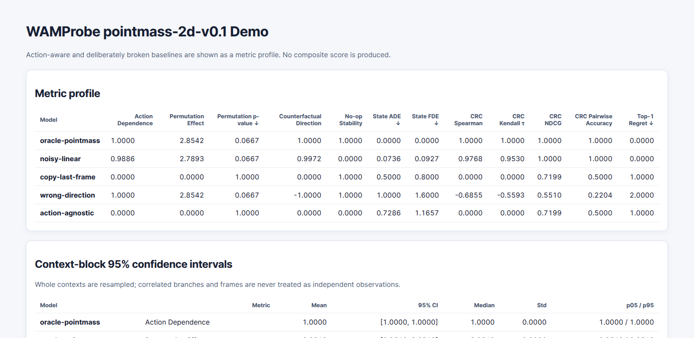

<p align="right">
  <strong>English</strong> · <a href="README.zh-CN.md">简体中文</a>
</p>

<p align="center">
  
</p>

<h1 align="center">WAMProbe</h1>

<p align="center">
  <strong>Counterfactual evaluation for World Action Models.</strong><br>
  Test whether predicted futures respond to the action, follow the right dynamics, and help a robot choose what to do.
</p>

<p align="center">
  <a href="https://github.com/myheart521/WAMProbe/actions/workflows/ci.yml"></a>
  <a href="https://github.com/myheart521/WAMProbe/actions/workflows/docs.yml"></a>
  <a href="https://pypi.org/project/wamprobe/"></a>
  <a href="https://github.com/myheart521/WAMProbe/releases"></a>
  <a href="https://www.python.org/"></a>
  <a href="LICENSE"></a>
</p>

<p align="center">
  <a href="https://myheart521.github.io/WAMProbe/"><strong>Documentation</strong></a> ·
  <a href="#60-second-start"><strong>Quick start</strong></a> ·
  <a href="#read-the-result"><strong>Example results</strong></a> ·
  <a href="docs/metrics/CORE_METRICS.md"><strong>Metric cards</strong></a> ·
  <a href="CONTRIBUTING.md"><strong>Contributing</strong></a>
</p>

> **Release status:** [`v0.1.0`](https://github.com/myheart521/WAMProbe/releases/tag/v0.1.0)
> is the stable release on [PyPI](https://pypi.org/project/wamprobe/0.1.0/).
> The dependency-free CPU core and maintainer clean-install acceptance are complete.
> [Issue #2](https://github.com/myheart521/WAMProbe/issues/2) records that evidence;
> no independent external reproduction is claimed.

## The problem WAMProbe tests

A World Action Model can generate a convincing success video while quietly ignoring the
candidate action. It can also react strongly to an action but predict motion in exactly
the wrong direction. A single video-quality or task-success number cannot distinguish
these failures.

WAMProbe restores **the same initial state** before every action branch and asks three
separate questions:

| Question | What is tested | Example failure caught |
|---|---|---|
| **Does the action matter?** | Separation and geometry of predicted futures across actions | Every action produces the same plausible future |
| **Is the response correct?** | Direction, state error, no-op behavior, and reference agreement | The model moves, but in the opposite direction |
| **Is the future useful?** | Candidate ranking, top-1 regret, and closed-loop return | Predictions look accurate but select a worse action |

WAMProbe reports these as a **metric profile**, never as one opaque composite score.

<p align="center">
  
</p>

## 60-second start

The core package has no runtime dependencies and the built-in benchmarks run on CPU.

```bash
python -m venv .venv
source .venv/bin/activate
python -m pip install wamprobe

wamprobe demo \
  --benchmark pointmass \
  --contexts 12 \
  --seed 7 \
  --output runs/pointmass-demo
```

Open `runs/pointmass-demo/report.html` in a browser, or inspect the versioned JSON and
Markdown outputs:

```text
runs/pointmass-demo/
├── summary.json   # machine-readable metrics, intervals, and paired differences
├── results.jsonl  # one stable record per model and shared context
├── report.md      # reviewable metric tables and interpretation
└── report.html    # standalone report, with no server required
```

For an exactly pinned installation:

```bash
python -m pip install wamprobe==0.1.0
```

## Read the result

The committed PointMass run includes an oracle and deliberately broken baselines. Three
rows already show why action dependence cannot be interpreted alone:

| Model | Action Dependence ↑ | Direction Alignment ↑ | Top-1 Regret ↓ | Diagnosis |
|---|---:|---:|---:|---|
| `oracle-pointmass` | 1.00 | 1.00 | 0.00 | Correct dynamics and selection |
| `wrong-direction` | 1.00 | **−1.00** | **2.00** | Action-sensitive but reversed |
| `action-agnostic` | **0.00** | 0.00 | **1.00** | Ignores the candidate action |

<p align="center">
  
</p>

<p align="center">
  
  <br>
  <sub>Actual standalone HTML report generated from the committed PointMass run.</sub>
</p>

These values come from the committed
[12-context PointMass report](examples/pointmass-demo/report.md), not from a hand-written
mockup. WAMProbe also commits expected profiles for
[BlockPush](examples/blockpush-demo/report.md),
[Gripper-Catch](examples/gripper-catch-demo/report.md), the
[video/control counterexample](examples/video-control-study/video-control-study.md), and
the [closed-loop study](examples/closed-loop-study/closed-loop-study.md).

## What is included

### Evaluation core

- typed, model-agnostic `WAMAdapter` and `ActionPredictorAdapter` protocols;
- capability declarations that prevent unsupported metrics from being silently reported;
- paired interventions generated from exactly restored shared contexts;
- context-block bootstrap intervals and exact-context paired model comparisons;
- corruption-detecting, content-addressed prediction caching for resumable runs;
- deterministic JSON/JSONL, Markdown, and standalone HTML reports;
- CPU-only, dependency-free runtime core for the analytic tier.

### Benchmarks and integrations

| Component | Scope | What it validates | Runtime |
|---|---|---|---|
| **PointMass-2D** | Built-in analytic benchmark | Direction, action dependence, ranking, and regret | Dependency-free CPU |
| **BlockPush-2D** | Contact-aware manipulation toy | Approach, contact, object motion, and rendered observations | Dependency-free CPU |
| **Gripper-Catch** | Attachment-aware manipulation toy | Alignment, close command, falling object, and attachment | Dependency-free CPU |
| **LIBERO-CF-Mini** | Four task families × four branches × eight steps | Exact simulator restore, repeatability, and branch-order independence | Opt-in isolated environment |
| **StarWAM path** | Pinned observation-to-action integration | Typed action-chunk inference and multi-seed/NFE execution evidence | Opt-in GPU environment |

The analytic benchmarks validate evaluator behavior; they are not evidence of transfer to
real robots. LIBERO-CF-Mini currently validates paired data generation, not policy quality.
The exact claims and limitations are recorded in the
[toy benchmark card](docs/benchmarks/TOY_BENCHMARKS.md),
[LIBERO-CF-Mini card](docs/benchmarks/LIBERO_CF_MINI.md), and
[StarWAM model card](docs/models/STARWAM.md).

## Metric profile

| Metric | Core question | Preferred direction |
|---|---|---|
| **Action Dependence** | Do predicted endpoints separate across candidate actions? | Higher, with other checks |
| **Permutation Effect / p-value** | Does predicted branch geometry match the true action geometry beyond label permutations? | Larger effect / smaller p-value |
| **Counterfactual Direction** | Is predicted displacement aligned with true displacement? | `1` aligned, `−1` reversed |
| **No-op Stability** | Does the no-op prediction agree with the true no-op future? | Higher |
| **State ADE / FDE** | How far is the predicted trajectory/final state from reference dynamics? | Lower |
| **Candidate Ranking Correlation** | Does the model order candidate actions like the simulator? | Higher |
| **Top-1 Regret** | How much true return is lost by choosing the model's favorite action? | Lower |
| **Closed-loop return / success** | Does score–execute–observe replanning actually work? | Higher |

Definitions, capability requirements, tie behavior, anti-gaming notes, and reference
baselines live in the [core metric cards](docs/metrics/CORE_METRICS.md). Traditional RGB
PSNR and global SSIM are available as diagnostics, but are intentionally kept separate
from state accuracy and control value.

## CLI map

| Command | Purpose |
|---|---|
| `wamprobe demo` | Run PointMass, BlockPush, or Gripper-Catch baseline diagnostics |
| `wamprobe report` | Rebuild reports from a saved `summary.json` without model inference |
| `wamprobe compare` | Compare two models over exactly aligned shared contexts |
| `wamprobe dataset-export` | Export a deterministic intervention JSONL suite |
| `wamprobe dataset-validate` | Validate dataset records and checksums |
| `wamprobe video-control-study` | Contrast rendered-video fidelity with control metrics |
| `wamprobe closed-loop-study` | Run minimal score–execute–observe replanning controls |
| `wamprobe experiment-report` | Analyze a cached real-model prediction/execution matrix |
| `wamprobe doctor` | Validate pinned model files, revisions, sizes, and hashes |
| `wamprobe release-audit` | Audit distributions and reproducibility evidence |

Run `wamprobe <command> --help` for the complete interface. The
[15-minute quick start](docs/QUICKSTART.md) covers every CPU-first workflow.

## Reuse results without rerunning a model

```bash
# Resume identical requests from content-addressed predictions.
wamprobe demo --contexts 12 --seed 7 \
  --cache-dir runs/cache --output runs/resumed

# Export and verify the exact intervention suite.
wamprobe dataset-export --benchmark pointmass --contexts 12 \
  --output data/pointmass.jsonl
wamprobe dataset-validate data/pointmass.jsonl

# Compare exact shared contexts, then rebuild presentation artifacts.
wamprobe compare runs/pointmass-demo runs/resumed \
  --left-model oracle-pointmass \
  --right-model copy-last-frame \
  --metric state_fde \
  --output runs/comparison.json
wamprobe report runs/pointmass-demo --output runs/rebuilt-report
```

## Use your own model

WAMProbe keeps adapters small on purpose. A state-future model implements `WAMAdapter`;
a model that directly predicts robot action chunks implements `ActionPredictorAdapter`.
Both expose a typed capability declaration so the evaluator can distinguish supported,
derived, and unavailable evidence.

```python
from wamprobe.api.capabilities import ModelCapabilities
from wamprobe.api.model import WAMAdapter


class MyWorldModel:
    @property
    def capabilities(self) -> ModelCapabilities:
        ...

    def predict_future(self, context, action, *, horizon: int, seed: int):
        ...

    def close(self) -> None:
        ...
```

Before publishing an adapter:

1. declare the actual output and runtime capabilities;
2. pin the upstream model revision and preprocessing contract;
3. run paired actions from identical context IDs;
4. add an expected baseline ordering and at least one failure-mode test;
5. document unsupported metrics instead of substituting a proxy.

Start with the [scope and capability RFC](docs/rfcs/0001-scope-and-capabilities.md),
[counterfactual metrics RFC](docs/rfcs/0002-counterfactual-metrics.md), and the
[adapter selection record](docs/research/ADAPTER_SELECTION.md).

For a working integration instead of pseudocode, run the tested
[custom adapter starter kit](examples/custom_adapter/README.md) and follow the
[step-by-step adapter guide](docs/adapters/CUSTOM_ADAPTER.md):

```bash
python -m examples.custom_adapter.run \
  --output runs/custom-adapter --contexts 8 --seed 7
```

## Real-model artifacts

Model weights are never committed to Git. The first StarWAM spike requires approximately
46.3 GB of pinned StarWAM and Wan2.2 artifacts. Follow the
[model-store layout and download rules](checkpoints/README.md), then validate everything
without importing PyTorch or upstream model code:

```bash
wamprobe doctor
wamprobe doctor --verify-hashes
```

The isolated StarWAM and LIBERO environments, GPU preflight, preprocessing provenance,
and smoke commands are documented in
[`environments/starwam/README.md`](environments/starwam/README.md) and
[`environments/libero/README.md`](environments/libero/README.md).

## Reproducibility by design

- deterministic seeded suites and stable context/action identifiers;
- checksummed intervention datasets and prediction artifacts;
- whole-context bootstrap resampling, never correlated frames or branches;
- exact-context alignment for paired comparisons;
- a versioned public JSON Schema and evidence manifest;
- byte-reproducible wheel/sdist builds and archive auditing;
- offline clean-wheel smoke tests and GitHub build-provenance attestations;
- Python 3.11–3.13 CI, linting, strict typing, coverage, schema validation, link checking,
  CodeQL, and strict documentation builds.

Review the [reproducibility guide](docs/reproducibility/REPRODUCIBILITY.md) and
[candidate release procedure](release/README.md) before comparing or publishing results.

## Documentation map

| If you want to… | Start here |
|---|---|
| Run the CPU demo | [Quick start](docs/QUICKSTART.md) |
| Understand the scientific motivation | [WAM/VLA failure-case evidence map](docs/research/WAM_VLA_FAILURE_CASES.md) |
| Interpret a score correctly | [Core metric cards](docs/metrics/CORE_METRICS.md) |
| Add a model integration | [Custom adapter starter guide](docs/adapters/CUSTOM_ADAPTER.md) |
| Submit a structured experiment | [Experiment result form](https://github.com/myheart521/WAMProbe/issues/new?template=experiment_result.yml) |
| Share an optional independent reproduction | [External reproduction form](https://github.com/myheart521/WAMProbe/issues/new?template=external_reproduction.yml) |
| Reproduce LIBERO-CF-Mini | [Benchmark card](docs/benchmarks/LIBERO_CF_MINI.md) |
| Inspect the closed-loop protocol | [Experiment card](docs/experiments/TOY_CLOSED_LOOP_V0.1.md) |
| Audit the release | [Reproducibility guide](docs/reproducibility/REPRODUCIBILITY.md) |
| Read the full implementation plan | [Detailed Chinese project plan](docs/WAMProbe_PLAN.md) |
| Choose the next milestone | [Dependency-aware roadmap](docs/NEXT_STEPS.md) |
| Browse all documentation | [Published documentation site](https://myheart521.github.io/WAMProbe/) |

## Project status and roadmap

The `v0.1.0` engineering scope and maintainer clean-install acceptance are complete.
[Issue #2](https://github.com/myheart521/WAMProbe/issues/2) records owner-run checks from
both the public wheel and PyPI. These checks are intentionally described as maintainer
evidence, not independent external reproduction.

The [dependency-aware roadmap](docs/NEXT_STEPS.md) separates completed release gates from
the next research milestones:

1. expand LIBERO initial-state coverage;
2. evaluate action-conditioned real-WAM futures when an adapter exposes that capability;
3. add the Occluded-Object memory diagnostic to the broader toy tier;
4. archive the stable release with a DOI and collect optional third-party reports.

## Contributing

Contributions are welcome—especially adapters, paired benchmark generators, metric
anti-gaming tests, and independent reproductions. New metrics must document the failure
they detect and include a sanity check against reference baselines.

Start with a labeled
[`good first issue`](https://github.com/myheart521/WAMProbe/labels/good%20first%20issue),
an [Adapter proposal](https://github.com/myheart521/WAMProbe/issues/new?template=adapter_proposal.yml),
or the [Experiment result form](https://github.com/myheart521/WAMProbe/issues/new?template=experiment_result.yml).

```bash
python -m pip install -e '.[dev]'
ruff format --check .
ruff check .
mypy
python scripts/validate_repository.py
mkdocs build --strict
pytest --cov=wamprobe --cov-report=term-missing --cov-fail-under=85
```

Read [CONTRIBUTING.md](CONTRIBUTING.md) before opening a pull request.

## Citation

If WAMProbe supports your work, cite the software release using
[`CITATION.cff`](CITATION.cff) or:

```bibtex
@software{wamprobe_2026,
  title   = {WAMProbe: Counterfactual Evaluation for World Action Models},
  author  = {{WAMProbe contributors}},
  year    = {2026},
  version = {0.1.0},
  url     = {https://github.com/myheart521/WAMProbe}
}
```

## License

WAMProbe is released under the [Apache License 2.0](LICENSE).
